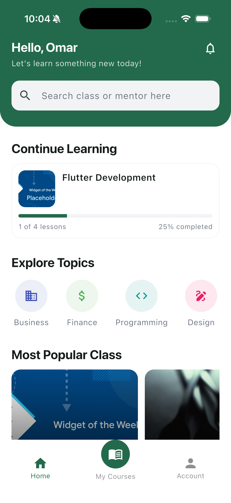
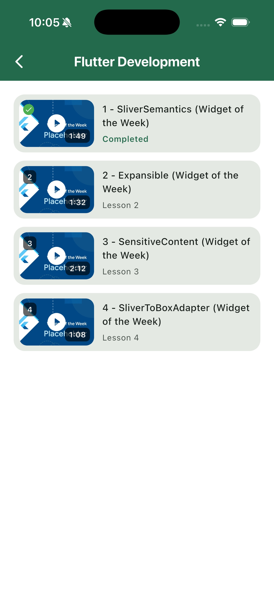
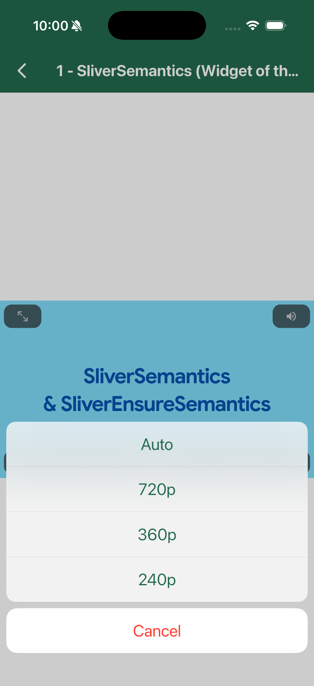
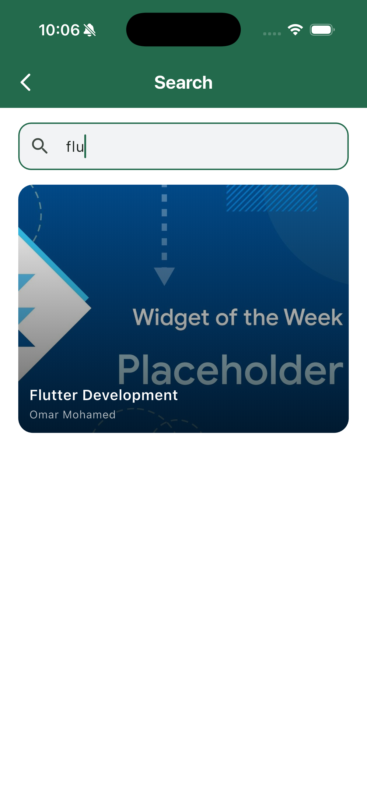

# E-Learning (Flutter + FastApi)

Monorepo for the e-learning app: a Flutter mobile client backed by a
local FastAPI video server that handles HLS transcoding and streaming.

```
.
├── backend/   FastAPI HLS video server (Python, PostgreSQL, FFmpeg)
└── mobile/    Flutter client app (iOS/Android)
```

## Overview

- **backend/** — A local FastAPI server that accepts uploaded MP4 videos, transcodes
  them to HLS with FFmpeg, and serves categories, videos, and HLS playlists/segments
  to the mobile app. See [`backend/README.md`](backend/README.md) for the full spec.
- **mobile/** — The Flutter app that browses courses/categories and plays videos via
  the backend's HLS streams, with Firebase used for auth/data.

## Architecture

For how the two projects fit together (request flow, the HLS pipeline, and the
mobile app's layering) see [`ARCHITECTURE.md`](ARCHITECTURE.md).

## Prerequisites

- Python 3.13+ and [`uv`](https://docs.astral.sh/uv/)
- PostgreSQL 
- FFmpeg (`ffmpeg -version` to check)
- Flutter SDK (Dart ^3.11.5) and a configured iOS/Android toolchain
- A Firebase project (for `flutterfire configure`)

## Running the backend

```bash
cd backend
uv sync

createdb elearning_stream            # create the local Postgres database
cp .env.example .env              # adjust DATABASE_URL if needed
uv run alembic upgrade head       # apply migrations

uv run uvicorn app.main:app --reload
```

The API docs are then available at `http://localhost:8000/docs`.

## Running the mobile app

```bash
cd mobile
flutter pub get

# Generates freezed/json_serializable/retrofit/isar code
dart run build_runner build

flutter run
```

<table border="0">
  <tr>
    <td></td>
    <td></td>
  </tr>
  <tr>
    <td></td>
    <td></td>
  </tr>
</table>
